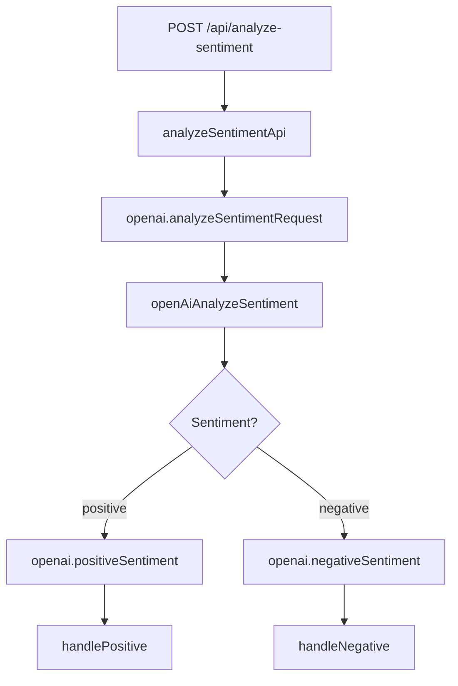

# SentimentAnalyzer 🎭

Ein event-getriebenes Sentiment-Analyse-System, gebaut mit dem [Motia](https://motia.dev) Framework. Dieses Projekt demonstriert, wie man OpenAI's GPT-Modelle nutzt, um Texte zu analysieren und basierend auf der Stimmung unterschiedliche Verarbeitungsschritte auszuführen.

## 📋 Über das Projekt

Der SentimentAnalyzer ist eine Microservice-basierte Anwendung, die:

- **HTTP API** bereitstellt zum Einreichen von Texten zur Analyse
- **OpenAI GPT-3.5-turbo** nutzt, um Sentiment-Analyse durchzuführen
- **Event-getriebene Verarbeitung** für positive und negative Sentiments
- **Real-time Feedback** durch asynchrone Event-Verarbeitung
- **Visual Workflow Designer** (Motia Workbench) zur Visualisierung der Datenflüsse

### Architektur

```
Text Input → API Step → OpenAI Analysis → Event Routing → Sentiment Handlers
     ↓             ↓           ↓              ↓              ↓
   POST /api    Emit Event   Parse JSON    Route Event   Process Result
```

## 🚀 Schnellstart

### Voraussetzungen

- **Node.js** 18+
- **npm** oder **yarn**
- **OpenAI API Key** (von [platform.openai.com](https://platform.openai.com))

### Installation

1. **Repository klonen**

   ```bash
   git clone https://github.com/amoerke/motia-sentiment-analyser.git
   cd SentimentAnalyzer
   ```

2. **Dependencies installieren**

   ```bash
   npm install
   ```

3. **Umgebungsvariablen konfigurieren**

   Erstelle eine `.env`-Datei im Projektordner:

   ```bash
   echo "OPENAI_API_KEY=your-openai-api-key-here" > .env
   ```

   > ⚠️ **Wichtig**: Ersetze `your-openai-api-key-here` mit deinem echten OpenAI API Key

4. **TypeScript-Typen generieren (macht Motia aber automatisch)**

   ```bash
   npm run generate-types
   ```

5. **Entwicklungsserver starten**

   ```bash
   npm run dev
   ```

Die Anwendung läuft dann auf `http://localhost:3000`

## 🛠️ Verfügbare Scripts

| Script                   | Beschreibung                                            |
| ------------------------ | ------------------------------------------------------- |
| `npm run dev`            | Startet den Entwicklungsserver mit Hot-Reload           |
| `npm run build`          | Erstellt einen Production-Build                         |
| `npm run generate-types` | Generiert TypeScript-Typen aus den Step-Konfigurationen |
| `npm run clean`          | Löscht alle Build-Artefakte und Dependencies            |

## 📝 API Verwendung

### Sentiment analysieren

**POST** `/api/analyze-sentiment`

```bash
curl -X POST http://localhost:3000/api/analyze-sentiment \
  -H "Content-Type: application/json" \
  -d '{"text": "Ich liebe dieses Projekt! Es ist fantastisch."}'
```

**Request Body:**

```json
{
  "text": "Der zu analysierende Text"
}
```

**Response:**

```json
{
  "status": "Accepted",
  "message": "Your text is being analyzed"
}
```

> **Hinweis**: Die API gibt sofort eine Antwort zurück (asynchrones Processing). Die eigentliche Sentiment-Analyse läuft im Hintergrund über Events.

## 🔧 Projektstruktur

```
SentimentAnalyzer/
├── steps/                          # Motia Steps (Hauptlogik)
│   ├── analyzeSentimentApi.step.ts    # HTTP API Endpoint
│   ├── openAiAnalyzeSentiment.step.ts # OpenAI Integration
│   ├── handlePositive.step.ts         # Positive Sentiment Handler
│   └── handleNegative.step.ts         # Negative Sentiment Handler
├── src/
│   └── services/                   # Business Logic Services
├── motia.config.ts                 # Motia Konfiguration
├── package.json                    # Project Dependencies
├── tsconfig.json                   # TypeScript Konfiguration
└── types.d.ts                      # Auto-generierte Typen
```

### Step-Übersicht

| Step                     | Typ   | Beschreibung                              |
| ------------------------ | ----- | ----------------------------------------- |
| `analyzeSentimentApi`    | API   | HTTP Endpoint - nimmt Text entgegen       |
| `openAiAnalyzeSentiment` | Event | Ruft OpenAI API auf, parsed JSON Response |
| `handlePositive`         | Event | Verarbeitet positive Sentiments           |
| `handleNegative`         | Event | Verarbeitet negative Sentiments           |

## 🔍 Workbench (Visual Designer)

Motia bietet eine visuelle Workbench zur Darstellung der Event-Flows:

1. Server starten: `npm run dev`
2. Workbench öffnen: `http://localhost:3000/workbench`
3. Flow "sentiment-app" auswählen

Du siehst dann eine visuelle Darstellung der Steps und Event-Verbindungen.

## 🌊 Event Flow



## ⚙️ Konfiguration

### OpenAI Konfiguration

Das Projekt nutzt GPT-3.5-turbo mit einem speziellen System-Prompt:

```typescript
const systemPrompt =
  'You are an assistant that returns only JSON: {"sentiment":"positive|negative","analysis":"...","advice":"..."} based on the sentiment of the provided text.';
```

### Motia Plugins

Aktivierte Plugins:

- **States Plugin**: State Management zwischen Steps
- **Endpoint Plugin**: HTTP API Funktionalität
- **Logs Plugin**: Strukturiertes Logging
- **Observability Plugin**: Monitoring und Metriken

## 🐛 Debugging

### Logs anzeigen

Motia bietet strukturiertes Logging. In der Entwicklung siehst du Logs in der Konsole:

```bash
[AnalyzeSentimentAPI] Received text: {"text":"..."}
[OpenAiSentimentAnalyzer] Analyzing sentiment for text: {"text":"..."}
[OpenAiSentimentAnalyzer] OpenAI response received: {"content":"..."}
```

### Häufige Probleme

1. **"OPENAI_API_KEY not found"**

   - Überprüfe deine `.env`-Datei
   - Server nach Änderungen neustarten

2. **"Invalid JSON response from OpenAI"**

   - OpenAI gibt manchmal nicht-JSON zurück
   - Überprüfe die System-Prompt Konfiguration

3. **Port bereits belegt**

   - Ändere den Port in `motia.config.ts` oder stoppe andere Services

## 🚀 Deployment

Für Production-Deployment:

1. **Build erstellen**

   ```bash
   npm run build
   ```

2. **Umgebungsvariablen setzen**

   ```bash
   export OPENAI_API_KEY=your-production-key
   ```

3. **Production-Server starten**

   ```bash
   npm start
   ```

## 🤝 Beitragen

1. Fork das Repository
2. Feature Branch erstellen (`git checkout -b feature/amazing-feature`)
3. Changes committen (`git commit -m 'Add amazing feature'`)
4. Branch pushen (`git push origin feature/amazing-feature`)
5. Pull Request öffnen

## 📚 Weitere Ressourcen

- [Motia Dokumentation](https://motia.dev/docs)
- [OpenAI API Dokumentation](https://platform.openai.com/docs)
- [Motia GitHub Repository](https://github.com/MotiaDev/motia)

## 📄 Lizenz

Dieses Projekt steht unter der MIT Lizenz - siehe [LICENSE](LICENSE) Datei für Details.

---

**Happy Coding!** 🎉

Wenn du Fragen hast oder Hilfe benötigst, schaue in die Motia Dokumentation oder öffne ein Issue in diesem Repository.
